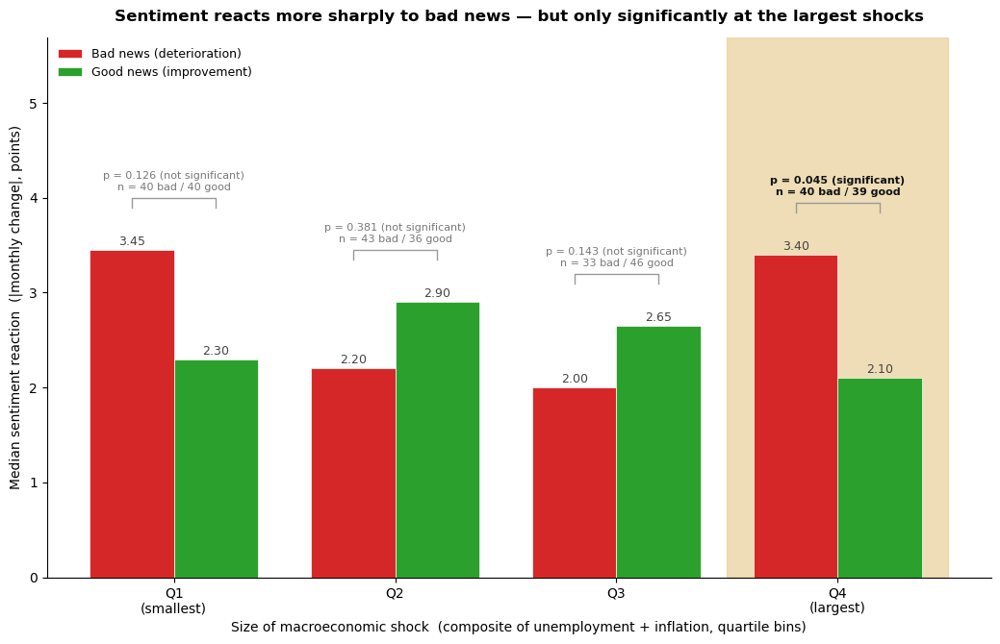
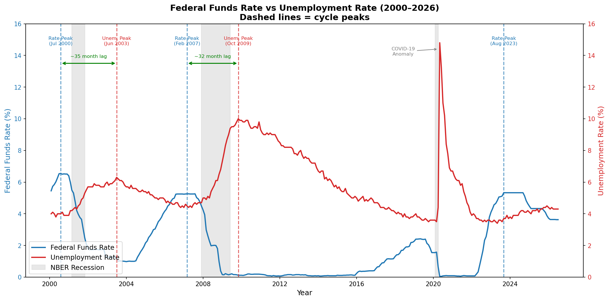
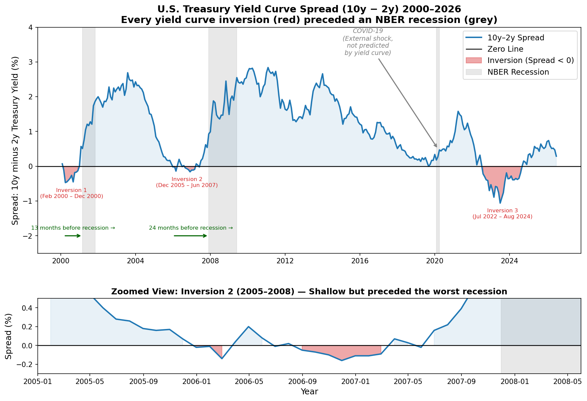
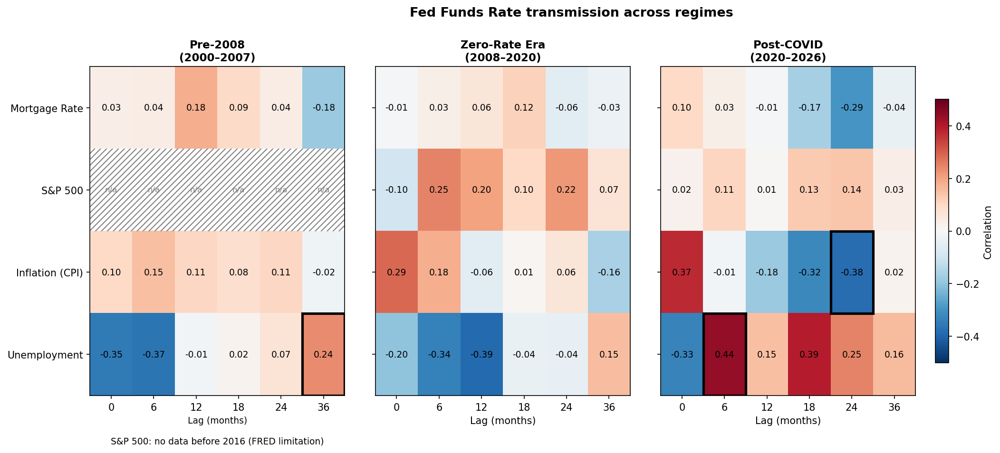

# U.S. Macroeconomic Indicators: A Visual Analysis (FRED, 2000–2026)


When the Federal Reserve raises interest rates, unemployment does not follow for roughly three years. This project traces that delay, and three other relationships, across eight U.S. macroeconomic indicators covering the dot-com bust, the 2008 financial crisis, and COVID.



## Key findings

* **Rate peaks lead unemployment peaks by about 32 to 35 months.** Both completed rate cycles confirm it, a longer lag than the commonly cited 12 to 24 month estimate.
* **Every economic-cycle recession in the window was preceded by a yield-curve inversion.** The 2020 COVID recession is the sole exception, and it was an external shock rather than a monetary-cycle downturn.
* **Fed rate transmission to unemployment is roughly 30 months faster after COVID.** The correlation turns positive at lag 36 pre-2008, but at lag 6 post-COVID.
* **Consumer sentiment reacts more sharply to bad news than to good news of comparable size, but only at the largest shocks.** The effect is statistically significant in the top shock quartile alone (p = 0.045), and is reported as suggestive rather than firm.

## Overview

Eight FRED series from 2000 to 2026, resampled to monthly frequency (about 310 rows). The analysis is split across two notebooks:

1. [`1_foundational_analysis.ipynb`](notebooks/1_foundational_analysis.ipynb) sets up the basic picture with two reference charts: the Federal Funds Rate against unemployment, and the 10-year minus 2-year yield spread as a recession signal.
2. [`2_transmission_and_sentiment.ipynb`](notebooks/2_transmission_and_sentiment.ipynb) does the deeper analysis: a lagged-correlation study of how rate changes spread through the economy, and a significance test of whether consumer sentiment reacts asymmetrically to good versus bad news.

Written in Python with pandas, Matplotlib, and Plotly.

## Dataset

The eight series are downloaded at run time from FRED's public CSV API (`https://fred.stlouisfed.org/graph/fredgraph.csv?id=<SERIES_ID>`) and resampled to month-end. No data files are stored in the repo, so a fresh run always uses the latest FRED numbers.

| Series | Description |
| --- | --- |
| `FEDFUNDS` | Effective Federal Funds Rate (%) |
| `DGS10` / `DGS2` | 10-year and 2-year Treasury yields (%) |
| `CPIAUCSL` | Consumer Price Index |
| `UNRATE` | Unemployment Rate (%) |
| `SP500` | S&P 500 Index |
| `MORTGAGE30US` | 30-year Fixed Mortgage Rate (%) |
| `UMCSENT` | U. Michigan Consumer Sentiment |

Derived columns include the yield-curve spread (`DGS10 - DGS2`), year-over-year inflation, and month-over-month changes used in the correlation analysis.

## Approach

A few deliberate choices shaped the analysis, mostly aimed at not letting the charts claim more than the data supports:

* **Correlations run on month-over-month changes, not levels.** Two series that both trend upward over 26 years will correlate strongly even when unrelated. Differencing removes that shared trend so the correlation reflects genuine co-movement.
* **Missing data is marked, never filled.** FRED's `SP500` series carries real data only from 2016 onward. Those cells are hatched as unavailable rather than backfilled with a constant, which would have manufactured a false correlation.
* **Comparisons are matched by magnitude.** Testing whether sentiment reacts more to bad news requires comparing shocks of similar size. Months are scored with a composite macro-stress measure (z-scored so unemployment and inflation contribute on equal footing), then binned by shock size, and good and bad months are compared only within a bin.
* **A rank-based significance test.** Monthly sentiment changes are skewed and contain outliers such as the COVID months, which would distort a mean-based t-test. The Mann-Whitney U test compares ranks and is robust to both.
* **Marginal results are labelled marginal.** The one significant sentiment result (p = 0.045) would not survive a strict correction for running four tests, so it is reported as suggestive, with the reasoning stated in the notebook rather than omitted.

## The notebooks

### 1. Foundational views: [`notebooks/1_foundational_analysis.ipynb`](notebooks/1_foundational_analysis.ipynb)

Two reference charts that frame the macro picture.

**Task (A.1): Do peaks in the Federal Funds Rate lead to rises in unemployment, and at what lag?** Overlay the two series and check whether rate-peak dates come before unemployment-peak dates across the major rate cycles.



**Result:** Both completed cycles confirm it.

* Rate peaked July 2000, unemployment peaked June 2003 (35-month lag).
* Rate peaked February 2007, unemployment peaked October 2009 (32-month lag).
* The lag of roughly 32 to 35 months runs longer than a first-glance 12 to 24 month estimate.
* The 2020 COVID spike is a separate pandemic-driven anomaly, and the 2023 hiking cycle is still unfolding.

**Task (A.2): Has the 10-year minus 2-year Treasury spread turned negative before every recession in the window?** Compute the spread, find its sub-zero episodes, and line them up against NBER recession start dates.



**Result:** Three inversions show up.

* February to December 2000, preceding the 2001 recession by 13 months.
* December 2005 to June 2007, preceding the 2008 recession by 24 months (shallow, but ahead of the worst downturn).
* July 2022 to August 2024, the deepest at -1.0%, with its outcome still unfolding.
* The 2020 COVID recession had no preceding inversion, being an external shock rather than a monetary-cycle downturn. Excluding that anomaly, every economic-cycle recession in the window was preceded by an inversion.

### 2. Transmission and sentiment: [`notebooks/2_transmission_and_sentiment.ipynb`](notebooks/2_transmission_and_sentiment.ipynb)

**Task (B.1): How does a change in the Federal Funds Rate transmit to mortgage rates, the S&P 500, inflation, and unemployment at different lags, and how does that differ across monetary regimes?** Correlations are computed on month-over-month changes at lags of 0, 6, 12, 18, 24, and 36 months, separately for three periods (pre-2008, the zero-rate era of 2008 to 2020, and post-COVID). The final chart is three side-by-side heatmaps so all periods read at once; an interactive Plotly version is also included.



**Result:**

* Transmission to unemployment is faster after COVID. In the pre-2008 period, unemployment's correlation with earlier Fed Funds changes only turns positive around lag 36. Post-COVID the same turn happens at lag 6 (+0.44), about 30 months sooner.
* Inflation gives the clearest signal: positive at lag 0 post-COVID (+0.37), turning negative by lags 18 to 24 (-0.32 to -0.38) as the rate hikes take effect.
* The S&P 500 correlations stay weak across all periods and get weaker post-COVID, consistent with markets pricing in expectations rather than reacting to the realized change.

**Task (B.2): Does consumer sentiment react more sharply to worsening conditions than to improvements of comparable size?** Each month is scored with a composite macro-stress measure, grouped into quartiles by shock size, and within each quartile the median sentiment reaction to bad-news months is compared against good-news months of similar size. A Mann-Whitney U test checks whether each gap is real or just noise, backed up by a swing-rate analysis (comparing the speed of drops against recoveries) and a test of the skew in the distribution of monthly changes.


**Result:** Sentiment does react asymmetrically, but only for the largest shocks.

* The bad-versus-good gap is significant only in the top shock quartile (Q4, p = 0.045; median 3.40 vs 2.10 points).
* The smaller quartiles show no significant difference, so their visible gaps are indistinguishable from noise.
* Because Q4 would not survive a strict correction for running four tests, it is reported as suggestive rather than a firm result. It aligns with the swing-rate analysis, where the sharpest declines outpace the sharpest recoveries.

## Repository structure

```
us-macro-indicators-viz/
├── notebooks/
│   ├── 1_foundational_analysis.ipynb
│   └── 2_transmission_and_sentiment.ipynb
├── figures/
│   ├── 1_foundational/
│   └── 2_transmission/
├── environment.yml
├── requirements.txt
└── README.md
```

Both notebooks render fully in GitHub's preview, figures included.

## Running it

The notebooks download data from FRED when they run, so you need an internet connection.

With conda:

```sh
conda env create -f environment.yml
conda activate vis-project
jupyter lab
```

With pip and venv:

```sh
python -m venv .venv
source .venv/bin/activate        # Windows: .venv\Scripts\activate
pip install -r requirements.txt
jupyter lab
```

Then open the notebooks in `notebooks/` and run all cells, starting with notebook 1.

## Notes and limitations

* The numbers reflect FRED data at run time and can move a little as series get revised.
* The Q4 sentiment result is marginal. The full significance discussion is in notebook 2.
* The S&P 500 series has no pre-2016 data on FRED, so those cells are left blank rather than filled in.
* Monthly data across 26 years is a modest sample for strong statistical claims, particularly once it is split by regime, which is why the sentiment finding is framed as suggestive.

## Acknowledgment

Built for the Visualization for AI course (BSc Artificial Intelligence) at Johannes Kepler University Linz.

## License

MIT License. See [LICENSE](LICENSE).